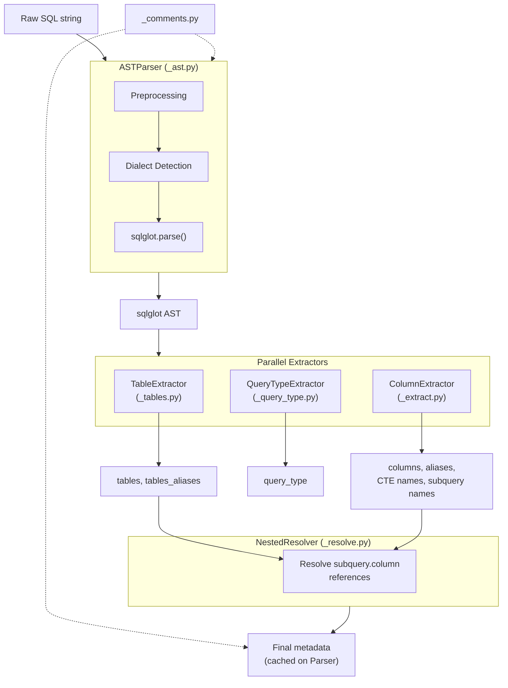
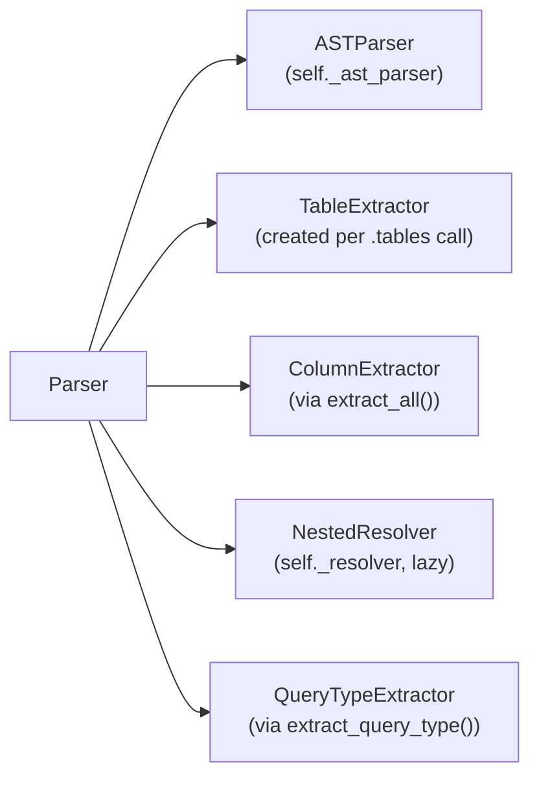
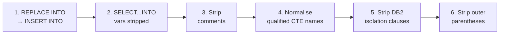
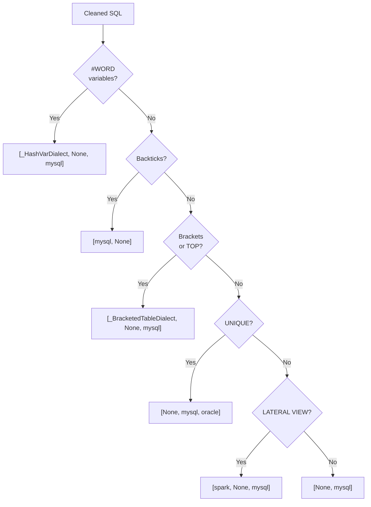
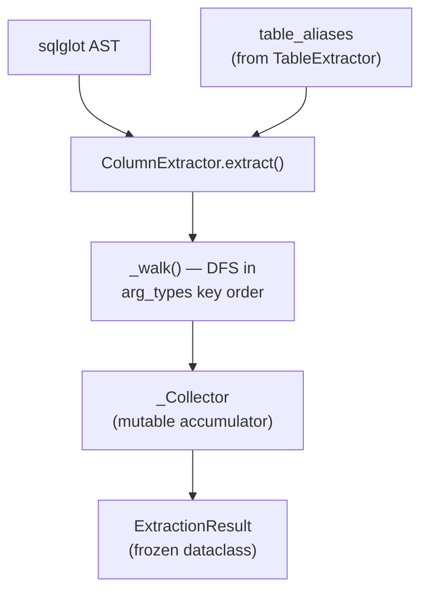
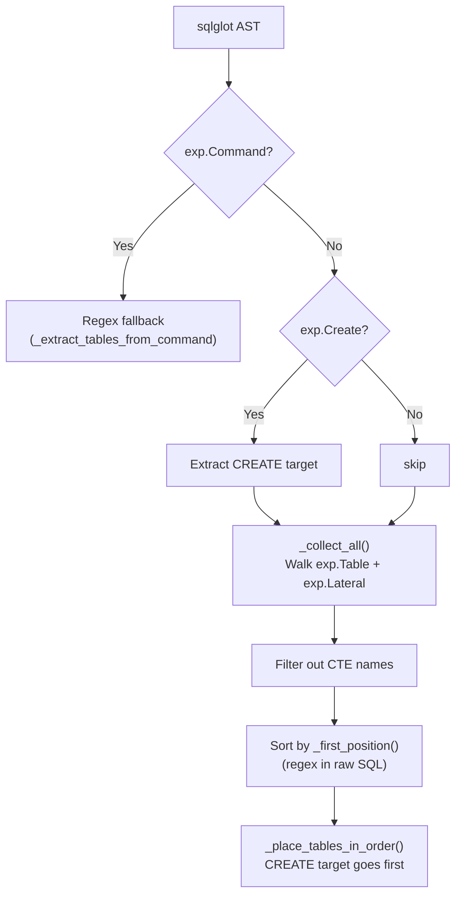
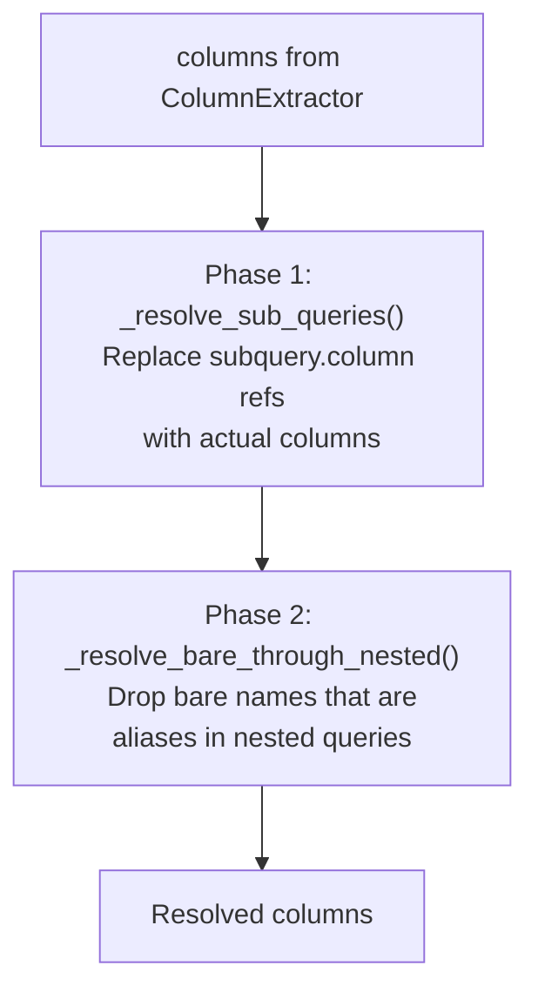
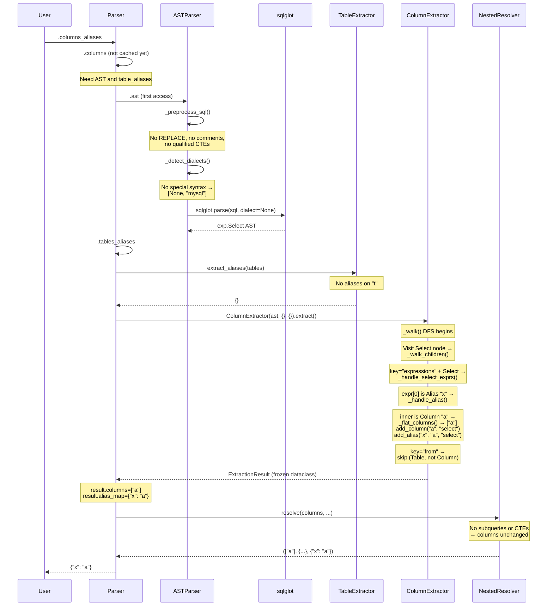
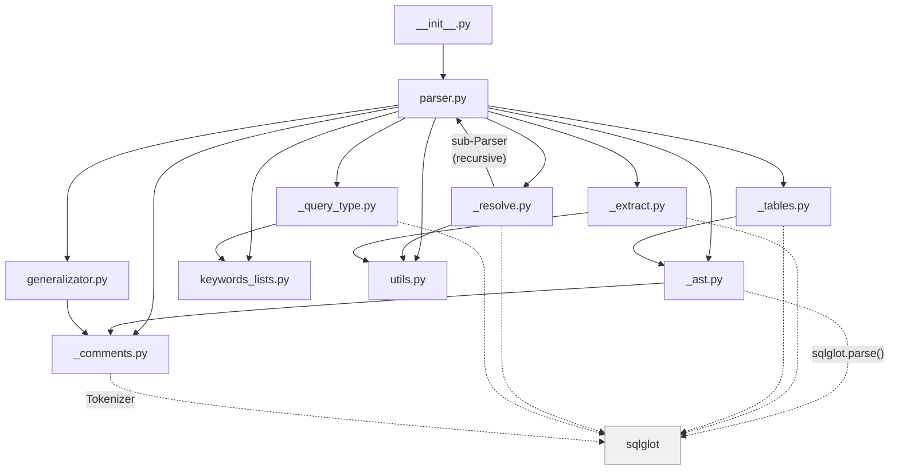

# Architecture

sql-metadata v3 is a Python library that parses SQL queries and extracts metadata (tables, columns, aliases, CTEs, subqueries, etc.). It delegates SQL parsing to [sqlglot](https://github.com/tobymao/sqlglot) for AST construction, then walks the resulting tree with specialised extractors.

## Module Map

| Module | Role | Key Class/Function |
|--------|------|--------------------|
| [`parser.py`](sql_metadata/parser.py) | Public facade — composes all extractors via lazy properties | `Parser` |
| [`_ast.py`](sql_metadata/_ast.py) | SQL preprocessing, dialect detection, AST construction | `ASTParser` |
| [`_extract.py`](sql_metadata/_extract.py) | Single-pass DFS column/alias/CTE extraction | `ColumnExtractor` |
| [`_tables.py`](sql_metadata/_tables.py) | Table extraction with position-based sorting | `TableExtractor` |
| [`_resolve.py`](sql_metadata/_resolve.py) | CTE/subquery body extraction and nested column resolution | `NestedResolver` |
| [`_query_type.py`](sql_metadata/_query_type.py) | Query type detection from AST root node | `QueryTypeExtractor` |
| [`_comments.py`](sql_metadata/_comments.py) | Comment extraction/stripping via tokenizer gaps | `extract_comments`, `strip_comments` |
| [`keywords_lists.py`](sql_metadata/keywords_lists.py) | Keyword sets, `QueryType` and `TokenType` enums | — |
| [`utils.py`](sql_metadata/utils.py) | `UniqueList` (deduplicating list), `flatten_list` | — |
| [`generalizator.py`](sql_metadata/generalizator.py) | Query anonymisation for log aggregation | `Generalizator` |

---

## High-Level Pipeline



The `Parser` class ([`parser.py`](sql_metadata/parser.py)) is a thin facade that orchestrates these components through lazy cached properties. No extraction work happens until a property like `.columns` or `.tables` is first accessed.

---

## Module Deep Dives

### Parser — the facade

**File:** [`parser.py`](sql_metadata/parser.py) | **Class:** `Parser`

The constructor (`__init__`, line 47) stores the raw SQL and initialises ~20 cache fields to `None`. It creates an `ASTParser` instance (lazy — no parsing yet) and defers everything else.

**Composition:**



**Public properties:**

| Property | Returns | Triggers |
|----------|---------|----------|
| `query` | Preprocessed SQL (normalised quoting) | — |
| `query_type` | `QueryType` enum | `QueryTypeExtractor(ast, raw_query).extract()` |
| `tokens` | `List[str]` of token strings | sqlglot tokenizer |
| `columns` | Column names | AST parse → TableExtractor → `ColumnExtractor.extract()` → NestedResolver |
| `columns_dict` | Columns by clause section | `.columns` |
| `columns_aliases` | `{alias: target_column}` | `.columns` |
| `columns_aliases_names` | List of alias names | `.columns` |
| `columns_aliases_dict` | Aliases by clause section | `.columns` |
| `tables` | Table names | AST parse → TableExtractor |
| `tables_aliases` | `{alias: real_table}` | AST parse → TableExtractor |
| `with_names` | CTE names | AST parse → ColumnExtractor |
| `with_queries` | `{cte_name: body_sql}` | NestedResolver |
| `subqueries` | `{subquery_name: body_sql}` | NestedResolver |
| `subqueries_names` | Subquery aliases (innermost first) | AST parse |
| `limit_and_offset` | `(limit, offset)` tuple | AST parse (regex fallback) |
| `values` | Literal values from INSERT | AST parse |
| `values_dict` | `{column: value}` pairs | `.values` + `.columns` |
| `comments` | Comment strings | sqlglot tokenizer |
| `without_comments` | SQL sans comments | sqlglot tokenizer |
| `generalize` | Anonymised SQL | Generalizator |

**Caching pattern** — every property checks its cache field first:

```python
@property
def tables(self) -> List[str]:
    if self._tables is not None:
        return self._tables
    # ... compute and cache ...
    self._tables = result
    return self._tables
```

**Regex fallbacks** — when `sqlglot.parse()` fails (raises `ValueError`), the parser falls back to regex extraction for columns (`_extract_columns_regex`, line 485) and LIMIT/OFFSET (`_extract_limit_regex`, line 463).

---

### ASTParser — SQL to AST

**File:** [`_ast.py`](sql_metadata/_ast.py) | **Class:** `ASTParser`

Wraps `sqlglot.parse()` with preprocessing, dialect auto-detection, and multi-dialect retry. Instantiated once per `Parser` — actual parsing is deferred until `.ast` is first accessed (line 170).

#### Preprocessing pipeline

`_preprocess_sql` (line 227) applies six steps in order:



| Step | Why | Example |
|------|-----|---------|
| REPLACE INTO rewrite | sqlglot parses `REPLACE INTO` as opaque `Command` | `REPLACE INTO t` → `INSERT INTO t` (flag set) |
| SELECT...INTO strip | Prevents sqlglot from treating variables as tables | `SELECT x INTO @v FROM t` → `SELECT x FROM t` |
| Comment stripping | Uses `strip_comments_for_parsing()` from `_comments.py` | `SELECT /* hi */ 1` → `SELECT 1` |
| CTE name normalisation | sqlglot can't parse `WITH db.name AS (...)` | `db.cte` → `db__DOT__cte` (reverse map stored) |
| DB2 isolation clauses | Removes trailing `WITH UR/CS/RS/RR` | `SELECT 1 WITH UR` → `SELECT 1` |
| Outer paren stripping | sqlglot can't parse `((UPDATE ...))` | `((UPDATE t SET x=1))` → `UPDATE t SET x=1` |

#### Dialect detection

`_detect_dialects` (line 461) inspects the SQL for syntax hints and returns an ordered list of dialects to try:



**Custom dialects:**

- `_HashVarDialect` (line 41) — treats `#` as part of identifiers for MSSQL temp tables (`#temp`)
- `_BracketedTableDialect` (line 62) — TSQL subclass for `[bracket]` quoting; also signals `TableExtractor` to preserve brackets in output

#### Multi-dialect retry

`_try_parse_dialects` (line 320) iterates through the dialect list. For each dialect:

1. Parse with `sqlglot.parse()` (warnings suppressed)
2. Check for degradation via `_is_degraded_result` — phantom tables (`IGNORE`, `""`), keyword-as-column names (`UNIQUE`, `DISTINCT`)
3. If degraded and not the last dialect, try the next one
4. If all fail, raise `ValueError("This query is wrong")`

---

### ColumnExtractor — columns, aliases, CTEs

**File:** [`_extract.py`](sql_metadata/_extract.py) | **Class:** `ColumnExtractor`

Performs a single-pass depth-first walk of the AST in `arg_types` key order (which mirrors left-to-right SQL text order). Collects columns, column aliases, CTE names, and subquery names into a `_Collector` accumulator. Returns an `ExtractionResult` frozen dataclass — consumed directly by `Parser.columns` and friends.

`Parser` calls `ColumnExtractor` directly (no wrapper functions):

```python
extractor = ColumnExtractor(ast, table_aliases, cte_name_map)
result = extractor.extract()  # returns ExtractionResult
result.columns        # UniqueList of column names
result.columns_dict   # columns by clause section
result.alias_map      # {alias: target_column}
```

Static methods `ColumnExtractor.extract_cte_names()` and `ColumnExtractor.extract_subquery_names()` are called independently by `Parser.with_names` and `Parser.subqueries_names`.

#### Data flow



#### DFS dispatch

The walk visits each node and dispatches to specialised handlers:

| AST Node Type | Handler | What it does |
|---------------|---------|-------------|
| `exp.Star` | `_handle_star` | Adds `*` (skips if inside function like `COUNT(*)`) |
| `exp.ColumnDef` | (inline) | Adds column name for CREATE TABLE DDL |
| `exp.Identifier` | `_handle_identifier` | Adds column if in JOIN USING context |
| `exp.CTE` | `_handle_cte` | Records CTE name, processes column definitions |
| `exp.Column` | `_handle_column` | Main handler — resolves table alias, builds full name |
| `exp.Subquery` (aliased) | (inline) | Records subquery name and depth for ordering |

**Special processing** in `_process_child_key` (line 426):
- SELECT expressions → `_handle_select_exprs` → iterates expressions, detects aliases
- INSERT schema → `_handle_insert_schema` → extracts column list from `INSERT INTO t(col1, col2)`
- JOIN USING → `_handle_join_using` → extracts column identifiers

#### Clause classification

`_classify_clause` (line 72) maps each `arg_types` key to a `columns_dict` section:

| Key | Section |
|-----|---------|
| `expressions` (under `Select`) | `"select"` |
| `expressions` (under `Update`) | `"update"` |
| `where` | `"where"` |
| `group` | `"group_by"` |
| `order` | `"order_by"` |
| `having` | `"having"` |
| `on`, `using` | `"join"` |

#### Alias handling

`_handle_alias` (line 533) processes `SELECT expr AS alias`:

1. If the aliased expression contains a subquery → walk it recursively, extract its SELECT columns as the alias target
2. If the expression has columns → add them, then register the alias mapping (unless it's a self-alias like `SELECT col AS col`)
3. If no columns (e.g., `SELECT 1 AS num`) → register the alias with no target

#### Date-part function filtering

`_is_date_part_unit` (line 109) prevents extracting unit keywords as columns in functions like `DATEADD(day, 1, col)` — `day` is a keyword, not a column reference.

---

### TableExtractor — tables and table aliases

**File:** [`_tables.py`](sql_metadata/_tables.py) | **Class:** `TableExtractor`

Walks the AST for `exp.Table` and `exp.Lateral` nodes, builds fully-qualified table names, and sorts results by first occurrence in the raw SQL.

#### Extraction flow



**Key algorithms:**

- **Name construction** — `_table_full_name` (line 181) assembles `catalog.db.name`, with special handling for bracket mode (TSQL) and double-dot notation (`catalog..name`)
- **Position sorting** — `_first_position` (line 200) finds each table name in the raw SQL via regex, preferring matches after table-introducing keywords (`FROM`, `JOIN`, `TABLE`, `INTO`, `UPDATE`). This ensures output order matches left-to-right reading order.
- **CTE filtering** — table names matching known CTE names are excluded, so only real tables appear in the output

**Alias extraction** — `extract_aliases` (line 157) walks `exp.Table` nodes looking for aliases:

```sql
SELECT * FROM users u JOIN orders o ON u.id = o.user_id
--                   ^            ^
--              alias="u"    alias="o"
-- Result: {"u": "users", "o": "orders"}
```

---

### NestedResolver — CTE/subquery resolution

**File:** [`_resolve.py`](sql_metadata/_resolve.py) | **Class:** `NestedResolver`

Handles the complete "look inside nested queries" concern. Created lazily by `Parser._get_resolver()` (line 83).

#### Three responsibilities

**1. Body extraction** — render CTE/subquery AST nodes back to SQL:

- `extract_cte_bodies` (line 137) — finds `exp.CTE` nodes in the AST, renders their body via `_PreservingGenerator`
- `extract_subquery_bodies` (line 165) — post-order walk so inner subqueries appear before outer ones
- `_PreservingGenerator` (line 23) — custom sqlglot `Generator` that preserves function signatures sqlglot would normalise (e.g., keeps `IFNULL` instead of converting to `COALESCE`, keeps `DIV` instead of `CAST(... / ... AS INT)`)

**2. Column resolution** — `resolve()` (line 202) runs two phases:



Phase 1 example:
```sql
SELECT sq.name FROM (SELECT name FROM users) sq
-- "sq.name" → resolved through subquery → "name"
```

Phase 2 example:
```sql
WITH cte AS (SELECT id, name AS label FROM users)
SELECT label FROM cte
-- "label" is an alias inside the CTE → dropped from columns, added to aliases
```

**3. Recursive sub-Parser instantiation** — when resolving `subquery.column`, the resolver creates a new `Parser(body_sql)` for each nested query body (cached in `_subqueries_parsers` / `_with_parsers`). This means the full pipeline runs recursively for each CTE/subquery.

#### Alias resolution with cycle detection

`_resolve_column_alias` (line 339) follows alias chains with a `visited` set to prevent infinite loops:

```python
# a → b → c (resolves to "c")
# a → b → a (cycle detected, stops at "a")
```

---

### QueryTypeExtractor

**File:** [`_query_type.py`](sql_metadata/_query_type.py) | **Class:** `QueryTypeExtractor`

Maps the AST root node type to a `QueryType` enum value via `_SIMPLE_TYPE_MAP` (line 19):

| AST Node | QueryType |
|----------|-----------|
| `exp.Select`, `exp.Union`, `exp.Intersect`, `exp.Except` | `SELECT` |
| `exp.Insert` | `INSERT` |
| `exp.Update` | `UPDATE` |
| `exp.Delete` | `DELETE` |
| `exp.Create` | `CREATE` |
| `exp.Alter` | `ALTER` |
| `exp.Drop` | `DROP` |
| `exp.TruncateTable` | `TRUNCATE` |
| `exp.Merge` | `MERGE` |

Special handling:
- Parenthesised queries → `_unwrap_parens` strips `Paren`/`Subquery` wrappers
- `exp.Command` → `_resolve_command_type` checks for `CREATE FUNCTION` / `ALTER`
- `REPLACE INTO` → detected via `ASTParser.is_replace` flag, patched in `Parser.query_type`

---

### Comments

**File:** [`_comments.py`](sql_metadata/_comments.py)

Exploits the fact that sqlglot's tokenizer skips comments — comments live in the *gaps* between consecutive token positions.

**Algorithm:**

1. Tokenize the SQL with the appropriate tokenizer
2. For each gap between token `[i].end` and token `[i+1].start`, scan for comment delimiters (`--`, `/* */`, `#`)
3. Collect or strip the matches

**Tokenizer selection** — `_choose_tokenizer` (line 27):
- If SQL contains `#` used as a comment (not a variable) → MySQL tokenizer (treats `#` as comment delimiter)
- Otherwise → default sqlglot tokenizer
- `_has_hash_variables` (line 47) distinguishes `#temp` (MSSQL) and `#VAR#` (template) from `# comment` (MySQL)

**Two stripping variants:**
- `strip_comments` (line 165) — public API, preserves `#VAR` references
- `strip_comments_for_parsing` (line 132) — internal, always strips `#` comments (needed before `sqlglot.parse()`)

---

### Supporting Modules

**[`keywords_lists.py`](sql_metadata/keywords_lists.py)** — keyword sets used for token classification and query type mapping:
- `KEYWORDS_BEFORE_COLUMNS` — keywords after which columns appear (`SELECT`, `WHERE`, `ON`, etc.)
- `TABLE_ADJUSTMENT_KEYWORDS` — keywords after which tables appear (`FROM`, `JOIN`, `INTO`, etc.)
- `COLUMNS_SECTIONS` — maps keywords to `columns_dict` section names
- `QueryType` — string enum (`str, Enum`) for direct comparison (`parser.query_type == "SELECT"`)

**[`utils.py`](sql_metadata/utils.py):**
- `UniqueList` — deduplicating list with O(1) membership checks via internal `set`. Used everywhere to collect columns, tables, aliases.
- `flatten_list` — recursively flattens nested lists from multi-column alias resolution.

**[`generalizator.py`](sql_metadata/generalizator.py)** — anonymises SQL for log aggregation: strips comments, replaces literals with `X`, numbers with `N`, collapses `IN(...)` lists to `(XYZ)`.

---

## Traced Walkthrough

Let's trace `Parser("SELECT a AS x FROM t").columns_aliases` step by step.



**What happened:**

1. **`Parser.__init__`** — stored raw SQL, created `ASTParser` (lazy)
2. **`.columns_aliases`** accessed → triggers `.columns` (not cached)
3. **`.columns`** needs the AST → accesses `self._ast_parser.ast`
4. **`ASTParser.ast`** (first access) → runs `_preprocess_sql` → `_detect_dialects` → `sqlglot.parse()`
5. **`.tables_aliases`** needed for column extraction → `TableExtractor.extract_aliases()` → `{}` (no aliases on `t`)
6. **`ColumnExtractor(ast, {}, {}).extract()`** → DFS walk:
   - Visits `Select` node, key `"expressions"` → `_handle_select_exprs()`
   - Finds `Alias(Column("a"), "x")` → `_handle_alias()` → records column `"a"` in select section, alias `"x"` → `"a"`
   - Key `"from"` → finds `Table("t")`, not a column node, skipped
7. **`NestedResolver.resolve()`** — no subqueries or CTEs, columns pass through unchanged
8. **Result cached** — `_columns = ["a"]`, `_columns_aliases = {"x": "a"}`

---

## Dependency Graph



Note the circular dependency: `_resolve.py` imports `Parser` from `parser.py` to create sub-Parser instances for nested queries. This import is deferred (inside method bodies, lines 314 and 367 of `_resolve.py`) to avoid import-time cycles.

---

## Key Design Patterns

**Lazy evaluation with caching** — every `Parser` property computes on first access and caches the result. This means you pay zero cost for properties you never access.

**Composition over inheritance** — `Parser` doesn't subclass anything meaningful. It composes `ASTParser`, `TableExtractor`, `ColumnExtractor`, `NestedResolver`, and `QueryTypeExtractor` as separate concerns.

**Single-pass DFS extraction** — `ColumnExtractor` walks the AST exactly once in `arg_types` key order. Because sqlglot's `arg_types` keys are ordered to mirror left-to-right SQL text, the walk naturally processes clauses in source order.

**Multi-dialect retry with degradation detection** — rather than guessing one dialect, `ASTParser` tries several in order and picks the first that doesn't produce a degraded result (phantom tables, keyword-as-column names).

**Graceful regex fallbacks** — when the AST parse fails entirely, the parser degrades to regex-based extraction for columns (INSERT INTO pattern) and LIMIT/OFFSET rather than raising an error.

**Recursive sub-parsing** — `NestedResolver` creates fresh `Parser` instances for CTE/subquery bodies. This reuses the entire pipeline recursively, with caching to avoid re-parsing the same body twice.
